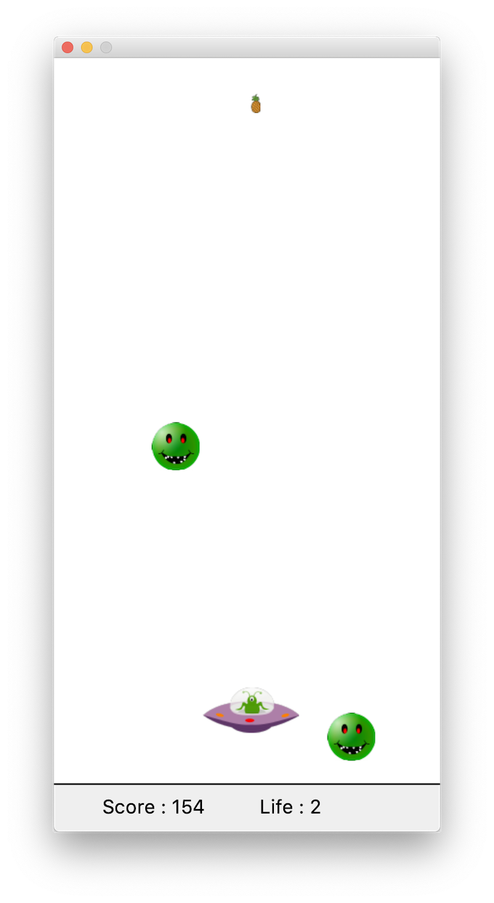

# Description du jeu

Dans ce mini jeu vidéo, l'objectif est de tuer un maximum d'ennemis. Les modes d'interactions sont les suivants :

- Touches de directions (gauche, droit, haut, bas)
- Touche espace pour tirer des annanas
- Clic gauche de la souris pour positionner le vaisseau à un endroit spécifique
- Clic droit de la souris pour faire apparaitre un menu contextuel (changement de vitesse des tirs)

Chaque ennemi détruit rapporte des points (en fonction de la position du vaisseau). Le joueur possède initialement 3 vies et perd une vie à chaque fois qu'un ennemi le touche. 




# À faire 

Pour mieux comprendre le fonctionnement du jeu, nous vous demandons d'apporter les modifications suivantes.


## Super ennemi

Faites en sorte que chaque ennemi ait un nombre de vies allant de 1 pour le plus petit à 5 pour le plus gros. Modifiez le programme pour titrer aléatoirement un type d'ennemi et ajuster à la fois sa taille et son nombbre de vies. Il faut regarder la classe `Enemy.java` ainsi que la méthode `spawnEnemies` de la classe `Main.java`.

## Pause active

Modifier le comportement du jeu pour créer une pause active lors d'un appui sur une touche spécifique. Dans cet état, le temps est figé mais il est toujours possible d'interagir avec le jeu (accès au menu contextuel du joueur par exemple).

La gestion du temps se fait dans la class `Main.java` avec le code suivant:

```java
gameLoop = new AnimationTimer() {
  @Override
  public void handle(long now) {
      // boucle du jeu 
  }
}
gameLoop.start();
```


